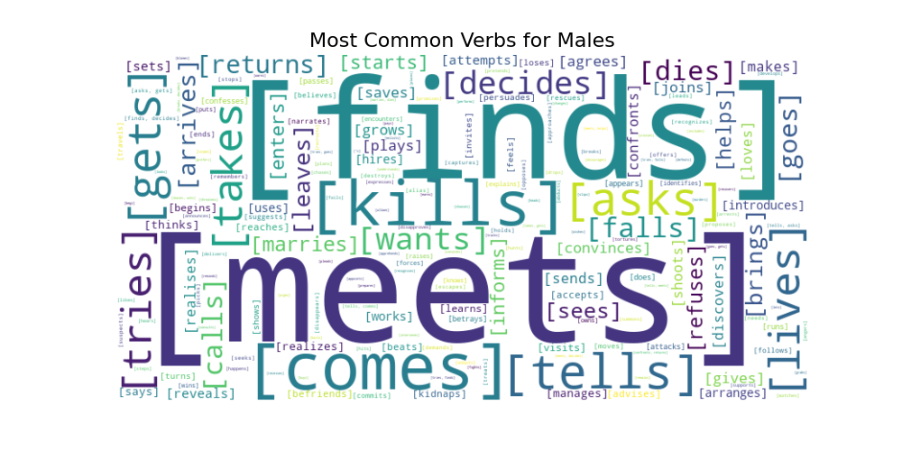
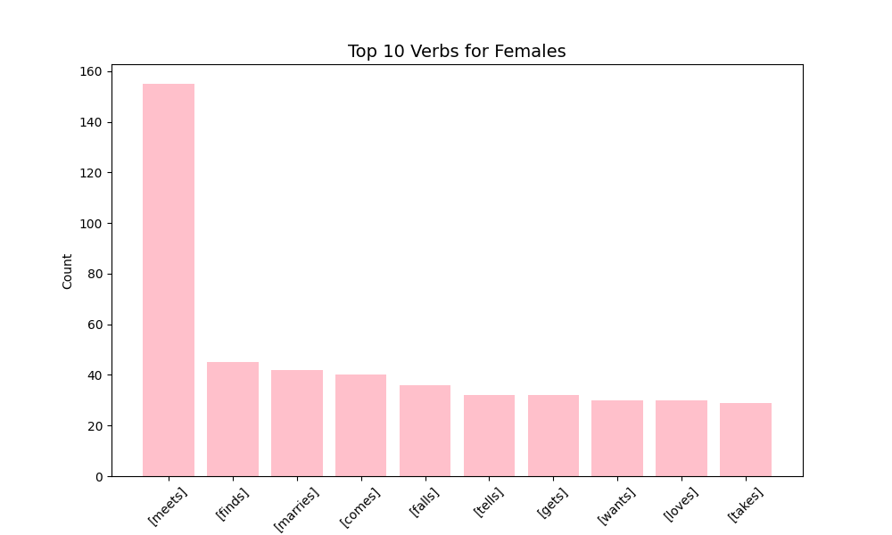
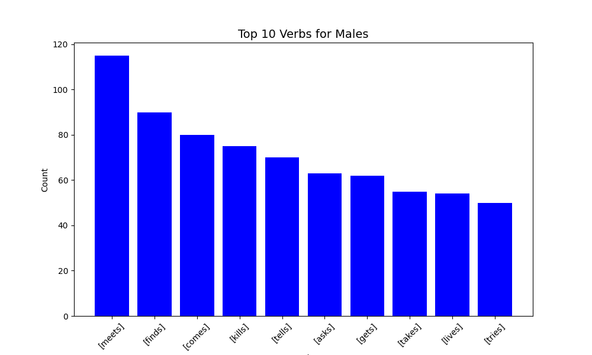
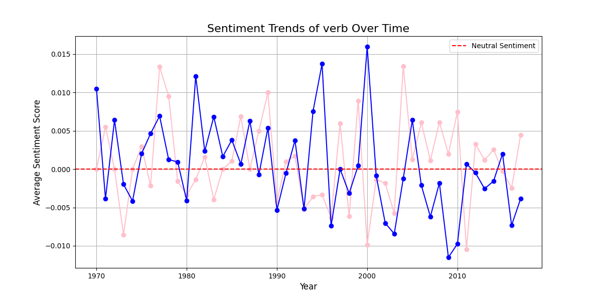
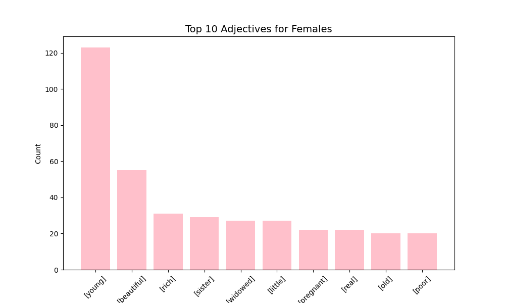
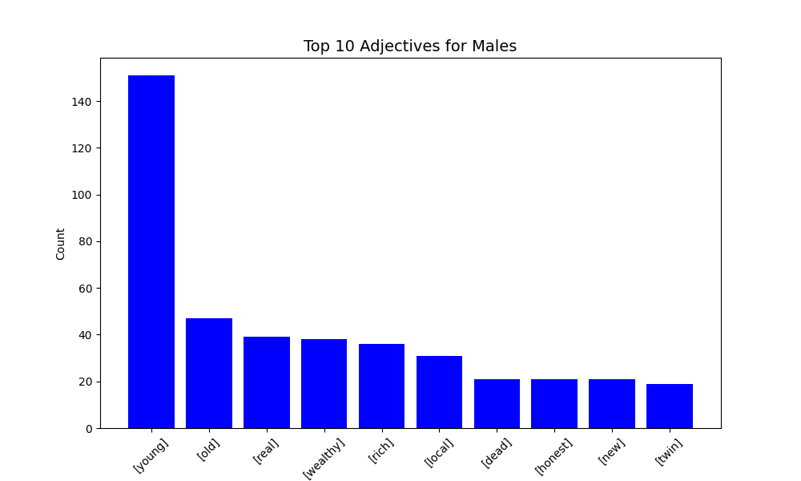
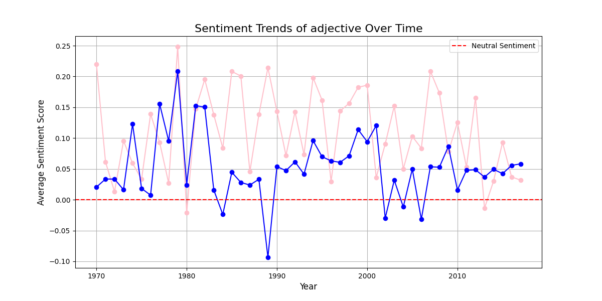
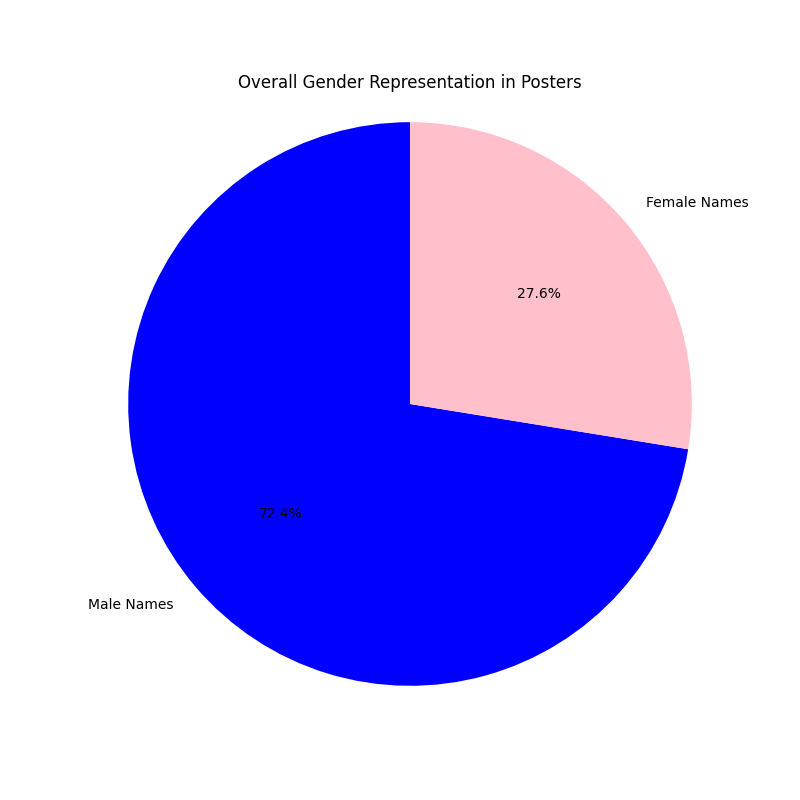

# Bollywood-Movie-analysis
## Using Verbs: (change heading)

Upon processing the verbs used by each character, we obtain the following word clouds:

Similarly, the most used verbs for the two genders are as follows:

Upon performing sentiment analysis, we obtain the following line graph, that varies with the years as well:

## Using Adjectives: (change heading)

Upon processing the adjectives used by each character, we obtain the following word clouds:

Similarly, the most used verbs for the two genders are as follows:

Upon performing sentiment analysis, we obtain the following line graph, that varies with the years as well:

## Using the Names from the Film Plot (image_and_plot_mentions_fequency.csv) :

By taking the count of the number of female and male names in the dataset, we can perform an analysis of the distribution of the genders in Indian cinema.

Upon analysis, we obtain that
Total Male Names: 5618.0
Total Female Names: 2138.0

Similarly,
Movies with no female names: 595
Movies with no male names: 166

The pie chart below shows the gender representation in total:

## Sentiment Analysis on Wikipedia Data: Adverb File

We conducted a sentiment analysis on an **adverb file** extracted from Wikipedia data, focusing on the representation of male and female characters. Key findings include:

- **Neutrality in Verbs:** Both male and female characters are primarily depicted using neutral verbs, with females showing a **slightly more positive inclination**.
- **Adjective Sentiment:** Adjectives used to describe female characters tend to be **slightly more positive** compared to those describing male characters.

